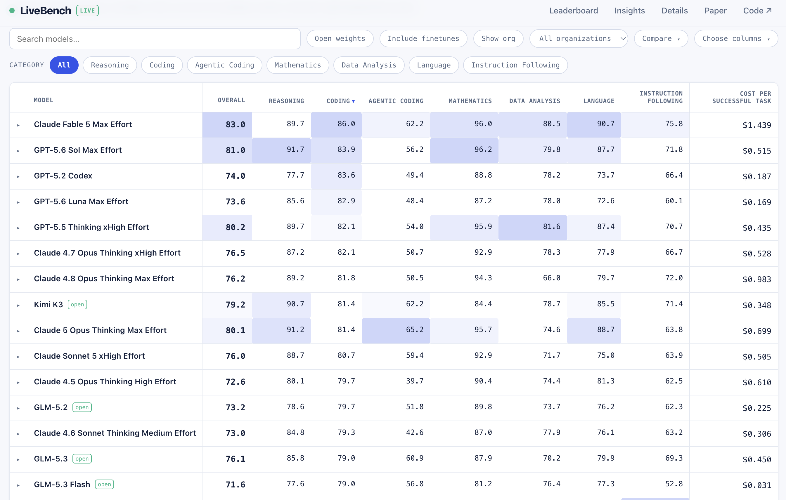

Opus 5 had me questioning reality while fixing an incident at work. Sort of like [this scene] from True Detective.

I wondered how a product could be that bad on purpose until it suddenly hit me: Opus 5 might be a [fighter brand] (also known as a flanker brand). A deliberately contrained offering meant to blunt cheap competition while nudging customers towards the company's premium options.

> The strategy is most often used in difficult economic times. As **customers trade down to lower-priced offers because of economic constraints**, many managers at mid-tier and premium brands are faced with a classic strategic conundrum: should they tackle the threat head-on and reduce existing prices, knowing it will reduce profits and potentially commodify the brand, or should they maintain prices, hope for better times to return, and in the meantime lose customers who might never come back. With both alternatives often equally unpalatable, **many companies choose the third option of launching a fighter brand.**

General Motors did this with Saturn to counter affordable Japanese manufacturers. Intel made Celeron to compete with cheap PCs. And Anheuser-Busch made Busch to fight off inexpensive local beers while making Budweiser feel more premium.

Sometimes it works (Intel and AB), sometimes it doesn't (Saturn).

It's no secret that Chinese models are catching up. At the time of writing this, Kimi K3, GLM 5.3 would make me nervous if I were OpenAI or Anthropic.

<em><a href="https://livebench.ai/#/?sort=Coding&dir=desc">Source</a></em>

"They copied us" is way more convenient than "Chinese labs created a product that reset customer expectations on price." 

My issue is this strategy is more like Saturn than Celeron and Busch in that they don't work well at all and end up being way more expensive. The part I may be missing is the opening of a new market with the fighter brand, which I have to guess is their Hail Mary. [The frontier labs already being unprofitable] only adds to the narrative.

The [verbose], [paranoid] reasoning almost feels designed to burn through a ton more tokens, which make up for the price cut. 

And I get it. One of the only things stopping the cheaper options from eating their lunch is the tool integrations to get easy, high-fidelity context like Jira, Glean, and GitHub, to name a few. I know these integrations and workarounds exist, but it's far from well-integrated at an enterprise level.

This is not to say that Fable or Codex aren't great - they are. It's that having to ship something worse to show strength actually just ends up highlighting weakness.

[this scene]: https://www.youtube.com/watch?v=O-tqam26CuA
[fighter brand]: https://en.wikipedia.org/wiki/Fighter_brand
[The frontier labs already being unprofitable]: https://arstechnica.com/ai/2026/06/leaked-financial-docs-show-openai-is-losing-billions-of-dollars-a-year/
[verbose]: https://x.com/ramonpiano_/status/2092333166769909805
[paranoid]: https://mun-logadan.github.io/why-does-opus-5-feel-worse/
